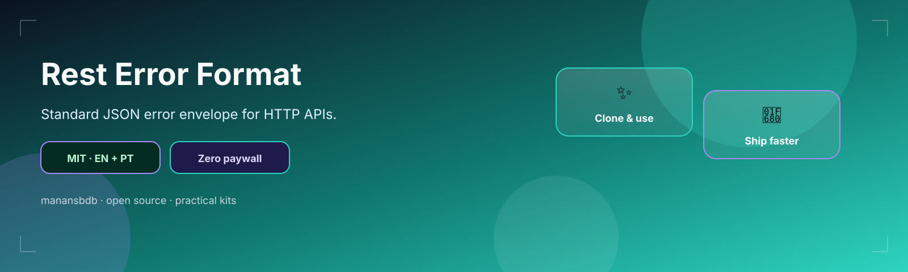

<p align="center">
  
</p>

<h1 align="center">rest-error-format</h1>

<p align="center">
  <strong>EN</strong> Standardized JSON error envelope for REST APIs<br/>
  <strong>PT</strong> Envelope JSON padronizado para erros REST
</p>

<p align="center">
  <a href="https://github.com/manansbdb/rest-error-format/blob/main/LICENSE"></a>
  
  
  <a href="#support--apoio"></a>
</p>

---

## What it does / Para que serve

| English | Português |
|---------|-----------|
| A **standard JSON error envelope** plus examples so clients parse failures consistently. | Um **envelope JSON de erro** padrão e exemplos para clientes tratarem falhas de forma consistente. |
| Adopt the shape in middleware and document it in your OpenAPI. | Adota o formato no middleware e documenta-o no OpenAPI. |


---

## Install / Instalação

### 1) Clone / Clona

```bash
git clone https://github.com/manansbdb/rest-error-format.git
cd rest-error-format
```

### 2) Apply / Aplica

```bash
mkdir -p docs/api
cp error-envelope.json docs/api/
cp examples.md docs/api/error-examples.md
# mirror the JSON shape in your error middleware
```

### Requirements / Requisitos

- `git`
- Any HTTP API stack

---

## Quick start / Início rápido

```bash
git clone https://github.com/manansbdb/rest-error-format.git
# open error-envelope.json and mirror fields in your API errors
```

---

## Contents / Conteúdos

| Path | Purpose / Função |
|------|------------------|
| `error-envelope.json` | Canonical error shape |
| `examples.md` | Sample payloads |
| `SUPPORT.md` | Donations / Doações |

---

## Project layout / Estrutura

```text
rest-error-format/
├── docs/banner.svg
├── error-envelope.json
├── examples.md
├── SUPPORT.md
└── README.md
```

---

## Support / Apoio

Bitcoin donations welcome / Doações em Bitcoin bem-vindas:

```
bc1q0qfnlnxyum9u45stzxe0a7jnhtj4j0usfkqdjw
```

See [SUPPORT.md](./SUPPORT.md).

---

## License / Licença

[MIT](./LICENSE) © 2026 manansbdb
